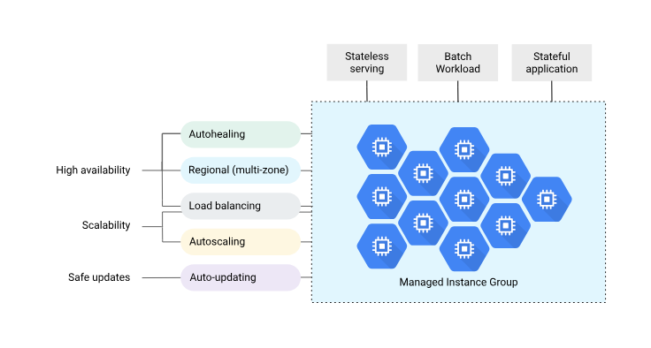

# Recursos de cómputo

- De derecha a izquierda vamos más desde IaaS hasta PaaS
- También crece el nivel de abstracción que se nos ofrece para interactuar con dichos recursos

## Compute Engine

- Alternativa de GCP a EC2 de Amazon o las VM de Azure
- Ofrece máquinas virtuales completamente configurables, con SLAs y precios acordes al mercado
- Se organizan en familias, series y tipos concretos para que sea lo ma2s fácil posible elegir la configuración que se adapte a nuestras necesidades
	- Una E2-medium es un *tipo concreto*
	- La familia es *General-Purpose*

### Familias
[Insertar cuadro]

- **Storage-optimized**: la uso para workloads pesados de almacenamiento
	- Guardado de 
- **Memory-optimized**: hasta 12TB de RAM. La uso para trabajos pesados en memoria
- **Compute-optimized**: tienen un CPU característico y potente. La uso para trabajos de procesamiento pesados.
- **Accelerator-optimized**: tengo acceso a GPUs de todo tipo.
	- Un uso actual muy latente es AI/ML
- **General-purpose**: te dan buen valor por lo que estás pagando, pero no les pidas mucho
	- No son para grandes servidores. Sirven para "iniciar" un negocio

### Preguntas
- Diferencias entre N2 y N4, y para qué elegimos c/u
	- [N2](https://docs.cloud.google.com/compute/docs/general-purpose-machines#n2_series) tiene 2 arquitecturas diferentes (Ice Lake, de 2019; Cascade Lake, de 2023). Se usa para workloads que aprovechen la alta frecuencia de reloj
	- [N4](https://docs.cloud.google.com/compute/docs/general-purpose-machines#n4_machine_types) es más nueva. Tiene una performance 40% mejor que su predecesor (N2). Es más caro porque hay más demanda y menos disponibilidad.
- Qué significa que una máquina tenga en su nombre -lssd? Y qué representan otras versiones de esta variación?
	- Tienen un SSD físico local asociado. Si pierdo la máquina, pierdo el disco. No están en rack, por ende no se persiste necesariamente.
	- Mover memoria virtual a estos discos es bastante generoso
	- Sus variaciones son: normal, standard y high.
- Qué significa que una serie termine en A o en D? Qué implica eso?
	- Cambia la arquitectura del procesador 
		- D es AMD (x86) y A es ARM. Si no tiene modificador, viene un Intel (x86)
		- Con ARM se reduce la compatibilidad con ciertos programas, además de que baja el consumo.
		- x86 es más barato

## Consumo
- GCP te cobra el CPU cuando la maquina está RUNNING o en PENDING_STOP
- También te cobra por la memoria cuando la máquina está RUNNING, en PENDING_STOP, SUSPENDING o SUSPEND
- Los recursos adjuntables (_attachable resources_) sobreviven a la máquina si pasa a TERMINATED y nos siguen cobrando por su uso (si corresponde). No puedo dettachear la CPU ni la RAM.
	- Ejemplos de attachables:
		- Interfaz de Red
		- GPU
		- Disco (SALVO el `lssd`, ya que no es dettachable. No puedo mover un SSD entre máquinas)
## Modelos de aprovisionamiento
- **Estándar**: reservo la máquina, me dan los recursos y me cobran según el estado de la máquina. Yo lo administro, y puedo determinar cuándo la freno/arranco.
- **Spot**: te las pueden sacar en cualquier momento con previo aviso, dependiendo de la disponibilidad de los recursos de GCP. "Dame lo que tengas barato y disponible".
	- Suelen ser entre 40-50% más barato que las estándar. En el mejor de los casos llega a 92%
	- No podés controlar cuándo se paran ni cuándo se eliminan, pero podés recuperar la configuración y el estado de la máquina.
	- Se usa bastante para procesos que pueden persistir el estado
- **Flex-start**: la inversa de Spot, "se levanta cuando puede". Tiene un tiempo máximo de 2hs para levantar el recurso. Es bastante más barata que las estándar.
	- Tenés control sobre la máquina.
	- Suele ser trabajo de batch-processing, porque podés albergar la máquina por un máximo de 7 días
- **Reservation-bound**: es para cuando vos sabés que vas a tener un workload por un tiempo prolongado, entonces lo reservás con antelación.

> No todas las máquinas pueden acceder a todos los modelos de provisioning

## Managed Instance Groups (MIGs)
Son análogos a los grupos de Auto-Scaling de AWS. Escalás horizontalmente en función del consumo, agregando máquinas de manera automática.

- Ante cierto $\%$ de uso de CPU o de memoria, levanto una nueva instancia.
- Se define un mínimo y un máximo de máquinas a tener en el MIG

Son $N$ máquinas virtuales administradas como un conjunto, siendo todas idénticas. Ofrece:
- **Alta disponibilidad**: nos ofrece `automatic repairs` basados en la salud de la VM y en la salud de la aplicación. Además, nos da soporte regional para el deployment de las VMs, de forma de que si falla una zona, nuestro servicio sigue funcionando. Con esta estructura podemos usar un _load balancer_ y distribuir la demanda.
- **Escalabilidad**: ante ciertos escenarios, el sistema puede levantar instancias nuevas para responder a picos de demanda
- **Automatic Updates**: podemos hacer `rollouts` de diferentes versiones de nuestra aplicación